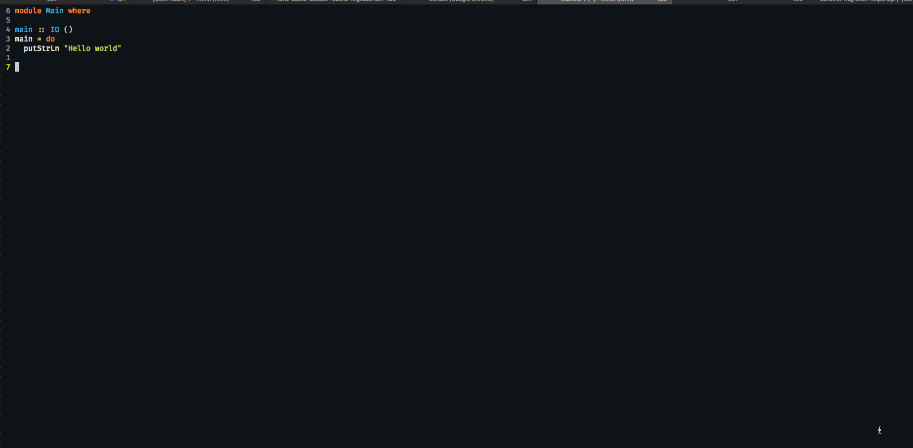
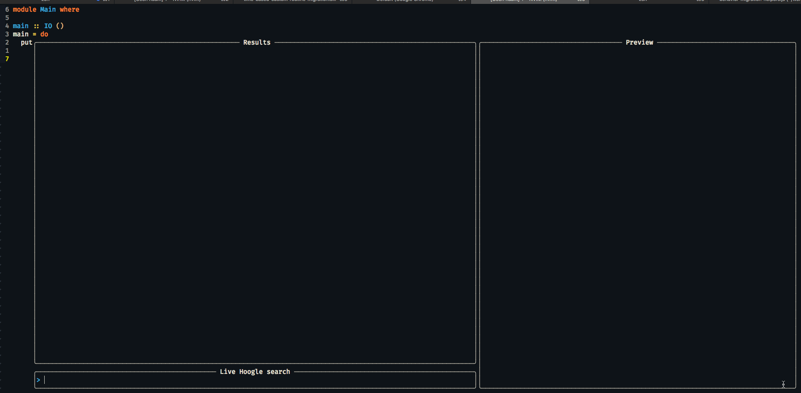

# telescope_hoogle

A telescope plugin for Hoogle.

## Keybindings

- `<C-b>`: opens selected entry in the browser:



- `<cr>`: copies selected entry to clipboard:



## Installation

1. Install [Telescope](https://github.com/nvim-telescope/telescope.nvim)
1. Install a recent Hoogle (needs to support `--json` flag)
2. Run `hoogle generate`
3. Install this plugin (for example: `paq 'luc-tielen/telescope_hoogle'`)
4. Add the following Lua snippet to your nvim config:

```lua
local telescope = require('telescope')
telescope.setup {
  -- opts...
}
telescope.load_extension('hoogle')
```

## Development

```bash
$ git clone git@github.com:luc-tielen/telescope_hoogle.git
$ cd telescope_hoogle
$ nvim --cmd "set rtp+=$(pwd)"
```
